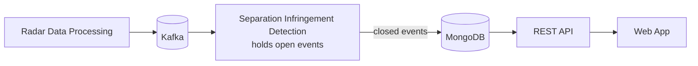
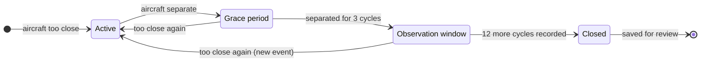

# ATC Safety Monitoring — How It Works

The system replays recorded radar data, detects aircraft that fly too close to each other, and lets safety analysts review each event.

## Separation minima infringement

A separation minima infringement happens when two aircraft are, **at the same time**:

- less than **5 NM** apart horizontally, **and**
- less than **1,000 ft** apart vertically.

These are the thresholds the demo stack runs with. They can be configured.

### Infringements detected so far (default demo data)

| Aircraft | Minimum separation |
|---|---|
| EZY4567 · RYR8814 | 2.0 NM / 0 ft |
| BEL3501 · EZY4567 | 1.3 NM / 201 ft |
| AUA789 · VLG567 | 2.9 NM / 0 ft |

## Services

### Application services

| Service | What it does |
|---|---|
| **Radar Data Processing** | This is the radar system. It scans the air and publishes the positions of aircraft in its range every 5 seconds. |
| **Separation Infringement Detection** | Finds aircraft that are too close and manages each event until it closes. |
| **REST API** | Backend for Frontend. Exposes REST APIs for safety events. |
| **Web App** | Where analysts review, escalate or dismiss events. |

### Infrastructure

| Service | What it does |
|---|---|
| **Kafka** | Carries the positions as a message stream. |
| **MongoDB** | Stores closed infringement events. |

## Data flow

## Event management in detection

Detection does more than spot two aircraft that are too close. It holds on to each event until the event is resolved.

- **Opens:** an event starts in the first radar cycle where the two aircraft break the minima.
- **Holds and updates:** while the event is open, detection keeps it in memory and updates it every cycle with both aircraft's positions and their closest approach.
- **Saves on close:** nothing is stored until the event closes. It is then saved to MongoDB and becomes available for review.

## How an event closes

- **Active:** the two aircraft are still too close.
- **Grace period:** the aircraft have separated. The system waits **3 radar cycles (~15 s)** to make sure. If they get too close again, the same event continues.
- **Observation window:** the system records **12 more cycles (~1 min)** of positions to show how the aircraft moved apart. If they get too close again, this event is dropped and a new one starts.
- **Closed:** the event is saved and appears in the Web App as **Pending Review**. An analyst then **escalates** or **dismisses** it.
